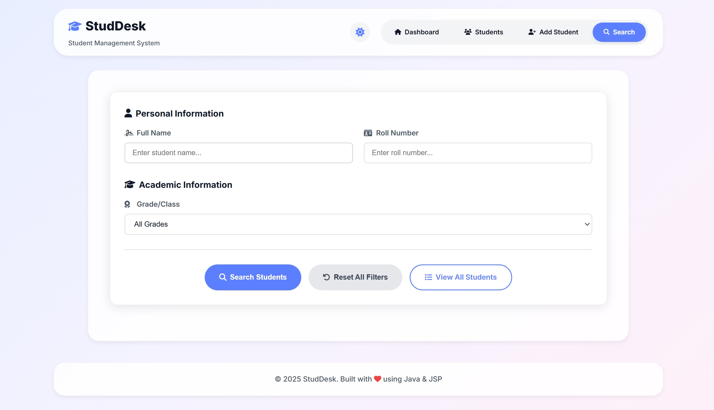
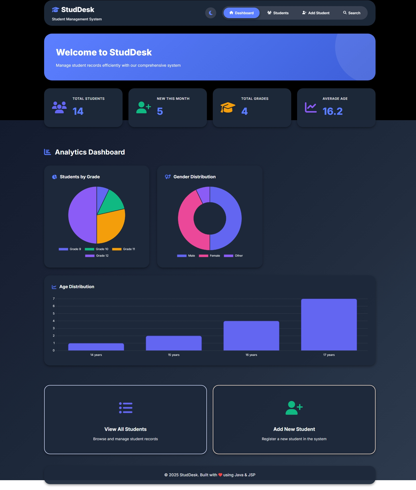

<div align="center">

# 🎓 StudDesk

### Modern Student Management System

*A comprehensive, feature-rich platform designed to streamline student record management for educational institutions*

[](https://www.oracle.com/java/)
[](https://www.mysql.com/)
[](https://maven.apache.org/)
[](LICENSE)

[Features](#-features) • [Demo](#-screenshots) • [Installation](#-quick-start) • [Documentation](#-documentation) • [Contributing](#-contributing)

</div>

---

## 📋 Table of Contents

- [Overview](#-overview)
- [Key Features](#-key-features)
- [Technology Stack](#-technology-stack)
- [Screenshots](#-screenshots)
- [Quick Start](#-quick-start)
- [Project Structure](#-project-structure)
- [Usage Guide](#-usage-guide)
- [API Documentation](#-api-documentation)
- [Contributing](#-contributing)
- [Roadmap](#-roadmap)
- [License](#-license)
- [Contact](#-contact)

---

## ✨ Overview

**StudDesk** is a production-ready student management system built with enterprise-grade Java technologies. It provides educational institutions with a powerful, intuitive platform for managing student records, tracking academic performance, and generating actionable insights through beautiful data visualizations.

### Why StudDesk?

- 🚀 **Lightning Fast** - Optimized database queries and efficient pagination
- 🎨 **Beautiful UI** - Modern, responsive design with dark mode support
- 🔍 **Advanced Search** - Multi-criteria search with intelligent filtering
- 📊 **Analytics Dashboard** - Real-time charts and performance metrics
- 🖨️ **Print Ready** - Professional printouts for student lists and details
- ♿ **Accessible** - WCAG-compliant design for inclusive access

---

## 🎯 Key Features

### 📚 Student Management
<table>
<tr>
<td>

**CRUD Operations**
- ✅ Create student records with validation
- 👁️ View detailed student profiles
- ✏️ Update student information
- 🗑️ Secure student deletion

</td>
<td>

**Data Validation**
- 📧 Email format validation
- 📞 Phone number verification
- 🔢 Unique roll number enforcement
- ⚠️ Real-time error feedback

</td>
</tr>
</table>

### 🔍 Search & Filter
- **Smart Search** - Find students instantly by name, roll number, or grade
- **Multi-Criteria Filtering** - Combine multiple search parameters
- **Live Results** - See results update as you type
- **Search History** - Track recent searches

### 📊 Analytics & Reporting
- **Visual Charts** - Grade distribution and gender statistics (Chart.js)
- **Performance Metrics** - Student count, growth trends, average metrics
- **Data Export** - CSV export for external analysis
- **Custom Reports** - Generate filtered student lists

### 🎨 User Experience
- **Dark Mode** - Eye-friendly theme with seamless switching
- **Responsive Design** - Perfect on desktop, tablet, and mobile
- **Modern Animations** - Smooth transitions and micro-interactions
- **Intuitive Navigation** - Clean, pill-style navigation menu

### 📄 Additional Features
- **Pagination** - Efficient browsing with customizable page sizes (10/25/50)
- **Print Support** - Professional layouts for printing
- **Error Handling** - Graceful error pages (404, 500)
- **Session Management** - 30-minute session timeout

---

## 🛠️ Technology Stack

### Backend
```
Java 17+          | Core programming language  
Servlets & JSP    | Web application framework  
JDBC              | Database connectivity  
MySQL 8.0+        | Relational database  
Maven             | Build & dependency management  
```

### Frontend
```
HTML5 & CSS3      | Modern web standards  
JavaScript ES6+   | Interactive functionality  
Chart.js          | Data visualization  
Font Awesome 6    | Icon library  
```

### DevOps & Tools
```
Apache Tomcat 7   | Application server  
Git               | Version control  
GitHub            | Code hosting  
```

---

## 🎨 Screenshots

### Dashboard - Analytics Overview
> *Real-time statistics and visual insights at a glance*


### Student List - Efficient Management
> *Paginated list with quick actions and search*


### Advanced Search - Find Anyone
> *Multi-criteria search with active filters*



### Dark Mode - Eye-Friendly Interface
> *Seamless theme switching for comfortable viewing*



---

## 🚀 Quick Start

### Prerequisites

Ensure you have the following installed:

- ☕ **Java JDK 17+** - [Download](https://www.oracle.com/java/technologies/downloads/)
- 📦 **Apache Maven 3.6+** - [Download](https://maven.apache.org/download.cgi)
- 🗄️ **MySQL Server 8.0+** - [Download](https://dev.mysql.com/downloads/mysql/)
- 🌐 **Apache Tomcat 7+** - [Download](https://tomcat.apache.org/download-70.cgi)

### Installation

1️⃣ **Clone the Repository**
```bash
git clone https://github.com/prashantpurwar12/StudDesk.git
cd StudDesk
```

2️⃣ **Set Up Database**
```sql
# Login to MySQL
mysql -u root -p

# Create database
CREATE DATABASE student_management_db;

# Use the database
USE student_management_db;

# Import schema
SOURCE database/setup_database.sql;

# Exit MySQL
exit;
```

3️⃣ **Configure Database Connection**

Edit `src/main/java/com/studdesk/util/DatabaseUtil.java`:

```java
private static final String URL = "jdbc:mysql://localhost:3306/student_management_db";
private static final String USER = "your_mysql_username";
private static final String PASSWORD = "your_mysql_password";
```

4️⃣ **Build the Project**
```bash
mvn clean package
```

5️⃣ **Run the Application**
```bash
mvn tomcat7:run
```

6️⃣ **Access StudDesk**

Open your browser and navigate to:
```
http://localhost:8081/StudDesk
```

🎉 **You're all set!** Start managing student records.

---

## 📁 Project Structure

```
StudDesk/
├── 📂 src/
│   ├── 📂 main/
│   │   ├── 📂 java/com/studdesk/
│   │   │   ├── 📂 controller/          # Servlet controllers
│   │   │   │   ├── StudentController.java
│   │   │   │   └── StudentAPIController.java
│   │   │   ├── 📂 dao/                 # Data Access Layer
│   │   │   │   ├── StudentDAO.java
│   │   │   │   └── StudentDAOImpl.java
│   │   │   ├── 📂 model/               # Entity classes
│   │   │   │   └── Student.java
│   │   │   ├── 📂 service/             # Business Logic
│   │   │   │   ├── StudentService.java
│   │   │   │   └── StudentServiceImpl.java
│   │   │   ├── 📂 dto/                 # Data Transfer Objects
│   │   │   │   └── StudentSearchCriteria.java
│   │   │   └── 📂 util/                # Utility classes
│   │   │       └── DatabaseUtil.java
│   │   └── 📂 webapp/
│   │       ├── 📂 css/                 # Stylesheets
│   │       │   └── style.css
│   │       ├── 📂 js/                  # JavaScript files
│   │       │   ├── theme-switcher.js
│   │       │   └── dashboard-analytics.js
│   │       ├── 📂 WEB-INF/             # Configuration
│   │       │   └── web.xml
│   │       ├── dashboard.jsp           # Main dashboard
│   │       ├── student-list.jsp        # Student listing
│   │       ├── student-detail.jsp      # Student details
│   │       ├── add-student.jsp         # Add new student
│   │       ├── edit-student.jsp        # Edit student
│   │       └── search-student.jsp      # Advanced search
├── 📂 database/                        # Database scripts
│   └── setup_database.sql
├── 📄 pom.xml                          # Maven configuration
├── 📄 README.md                        # This file
├── 📄 .gitignore                       # Git ignore rules
└── 📄 LICENSE                          # MIT License

```

---

## 📖 Usage Guide

### Managing Students

#### ➕ Adding a New Student

1. Click **"Add New Student"** on the dashboard or student list
2. Fill in the required fields:
   - Full Name
   - Roll Number (must be unique)
   - Grade (9, 10, 11, or 12)
   - Email
   - Phone (10 digits)
   - Gender
   - Date of Birth
3. Click **"Submit"** to save

#### 🔍 Searching for Students

1. Navigate to **Search** from the navigation menu
2. Enter search criteria:
   - Name (partial match supported)
   - Roll Number
   - Grade
3. Click **"Search Students"**
4. View results with active filter display
5. Use **"Reset All Filters"** to clear

#### 👁️ Viewing Student Details

1. Click the **eye icon** (👁️) next to any student
2. View comprehensive student information
3. Actions available:
   - **Edit Profile** - Update student details
   - **Delete Student** - Remove student record
   - **Print** - Print student details

#### 🖨️ Printing Student Lists

1. Go to **Student List** page
2. Apply any filters if needed
3. Click **"Print List"** button
4. Print dialog opens automatically
5. Configure print settings and print

---

## 🔌 API Documentation

### Student API Endpoint

**GET** `/api/students`

Returns a JSON response with all students and analytics data.

**Response Format:**
```json
{
  "total": 150,
  "students": [
    {
      "id": 1,
      "fullName": "John Doe",
      "rollNumber": "2024001",
      "grade": "12",
      "email": "john.doe@example.com",
      "phone": "1234567890",
      "gender": "Male",
      "dateOfBirth": "2006-05-15"
    }
  ],
  "analytics": {
    "gradeDistribution": {
      "9": 35,
      "10": 40,
      "11": 42,
      "12": 33
    },
    "genderDistribution": {
      "Male": 78,
      "Female": 72
    }
  }
}
```

---

## 🤝 Contributing

Contributions make the open-source community an amazing place to learn, inspire, and create. Any contributions you make are **greatly appreciated**!

### How to Contribute

1. **Fork** the Project
2. **Create** your Feature Branch
   ```bash
   git checkout -b feature/AmazingFeature
   ```
3. **Commit** your Changes
   ```bash
   git commit -m 'Add some AmazingFeature'
   ```
4. **Push** to the Branch
   ```bash
   git push origin feature/AmazingFeature
   ```
5. **Open** a Pull Request

### Development Guidelines

- ✅ Follow Java naming conventions and code style
- ✅ Write clean, self-documenting code
- ✅ Add comments for complex logic
- ✅ Test thoroughly before submitting
- ✅ Update documentation for new features
- ✅ Ensure backward compatibility

---

## 🐛 Known Issues & Limitations

- **Select Dropdown Styling** - Native browser select dropdowns have limited CSS styling on Windows browsers
- **Session Timeout** - Users are logged out after 30 minutes of inactivity
- **Database Connection** - Currently configured for local MySQL only

---

## 🗺️ Roadmap

### Phase 1 - Current Release ✅
- [x] Core CRUD operations
- [x] Advanced search and filtering
- [x] Dashboard analytics
- [x] Dark mode support
- [x] Print functionality

### Phase 2 - Next Release 🚧
- [ ] **Bulk Import** - CSV/Excel file import for students
- [ ] **Photo Upload** - Student profile pictures
- [ ] **Attendance System** - Daily attendance tracking
- [ ] **Parent Portal** - Separate login for parents

### Phase 3 - Future Enhancements 💡
- [ ] **Report Cards** - Auto-generated printable report cards
- [ ] **SMS/Email Notifications** - Automated alerts
- [ ] **Multi-language Support** - Internationalization
- [ ] **Mobile App** - Native Android/iOS applications
- [ ] **Cloud Deployment** - AWS/Azure hosting guides

---

## 📄 License

This project is licensed under the **MIT License** - see the [LICENSE](LICENSE) file for details.

```
MIT License - Copyright (c) 2025 StudDesk

Permission is hereby granted, free of charge, to any person obtaining a copy
of this software and associated documentation files (the "Software"), to deal
in the Software without restriction, including without limitation the rights
to use, copy, modify, merge, publish, distribute, sublicense, and/or sell
copies of the Software, and to permit persons to whom the Software is
furnished to do so, subject to the following conditions:

The above copyright notice and this permission notice shall be included in all
copies or substantial portions of the Software.
```

---

## 👨‍💻 Contact & Support

<div align="center">

**Created and Maintained by Prashant Purwar**

[](https://github.com/prashantpurwar12)
[](https://www.linkedin.com/in/prashant-purwar-230966264/)
[](mailto:work.prashantpurwar@gmail.com)

</div>

---

<div align="center">

### ⭐ Star this repository if you find it helpful!

**Made with ❤️ for education**

*Empowering institutions to manage student data efficiently*

[Back to Top ⬆️](#-studdesk)

</div>
